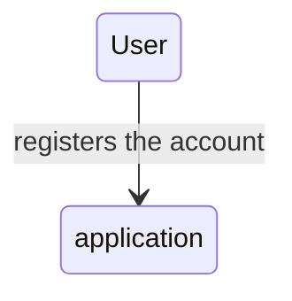

# circum-web3
implementation concerning the smart contract side of project.  These contract will work primarily on: 

1.  FOAM proof of location, where user will submit the picture (represented by their address with hash) along with the location,

2. And then based on the prediction of the DL, we will be updating the score from the model corresponding to the each submission, thus giving crediblity to the submitters information.

3. Also it uses the ocean protocol in order to create datamarkets and adding of the user images as NFT.

## setup 

1. set `.env` parameters 

TODO: 

